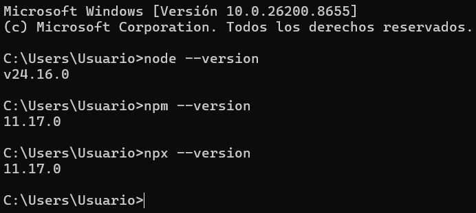
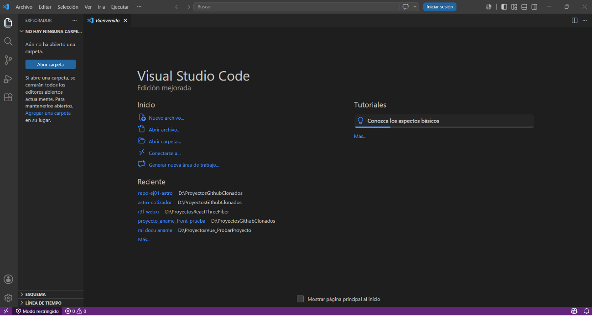
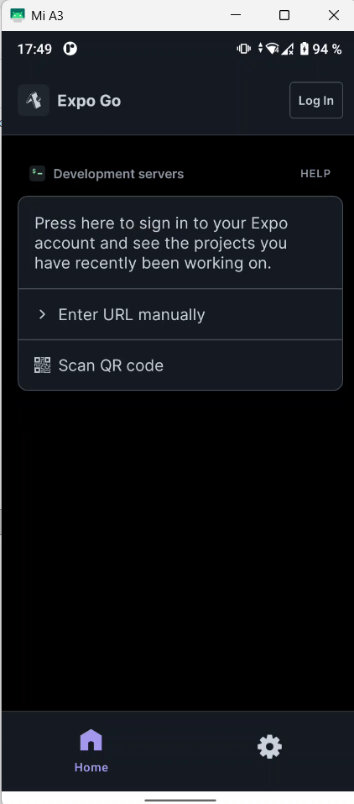
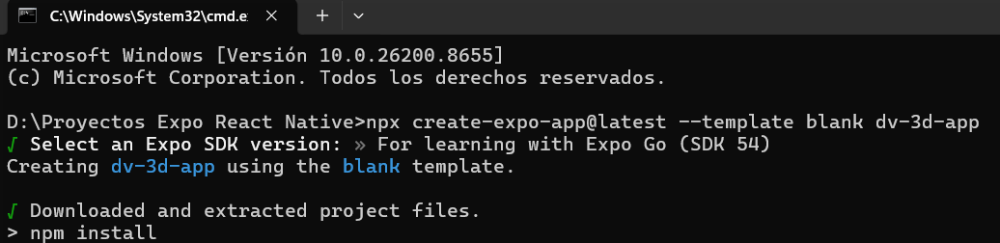
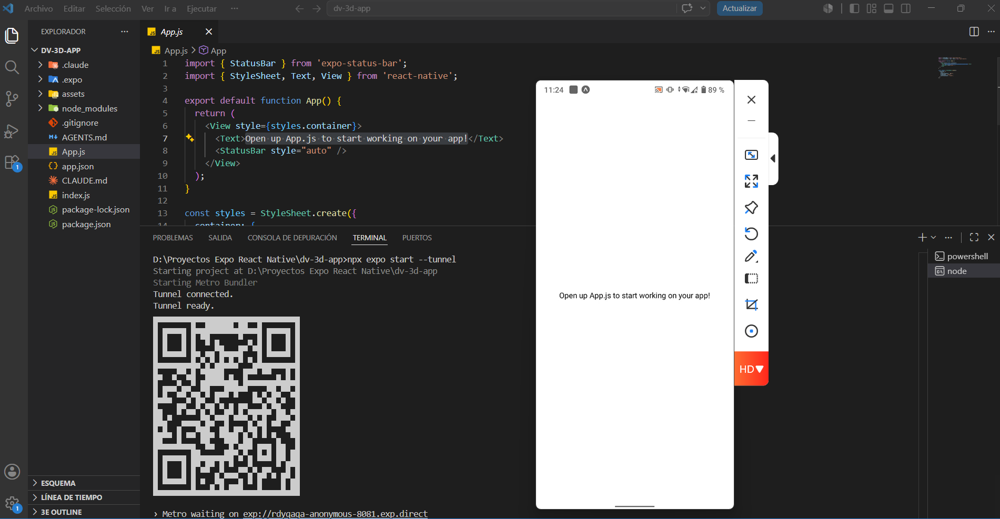

# dv3D

Aplicación móvil para visualización interactiva de objetos 3D, desarrollada con **Expo React Native** y **React Three Fiber**.

> **Estado actual del proyecto:** 🚧 En desarrollo — MVP en construcción. Las funcionalidades descritas en este documento corresponden al alcance planificado para la primera versión (MVP).

---

## Tabla de contenidos

- [Problema que resuelve](#problema-que-resuelve)
- [Objetivo de la aplicación](#objetivo-de-la-aplicación)
- [Historias de usuario del MVP](#historias-de-usuario-del-mvp-producto-mínimo-viable)
- [Tecnología usada](#tecnología-usada)
- [Instrucciones de instalación](#instrucciones-de-instalación)
- [Estado actual del proyecto](#estado-actual-del-proyecto)

---

## Problema que resuelve

La falta de aplicaciones móviles enfocadas en visualización 3D interactiva dificulta que los usuarios experimenten nuevas formas de interacción digital mediante modelos tridimensionales, especialmente en proyectos educativos, demostrativos o de aprendizaje tecnológico.

Ante esta situación, surge la necesidad de desarrollar una aplicación móvil que permita la visualización interactiva de objetos en 3D utilizando **Expo React Native** y **React Three Fiber**, con el propósito de ofrecer una experiencia gráfica moderna y dinámica en dispositivos móviles.

## Objetivo de la aplicación

Desarrollar una aplicación móvil utilizando Expo React Native con React Three Fiber, que permita la visualización interactiva de objetos tridimensionales ofreciendo una experiencia gráfica dinámica y moderna en dispositivos móviles.

## Historias de usuario del MVP (Producto Mínimo Viable)

| ID | Título | Historia |
|----|--------|----------|
| HU-01 | Registro | Como visitante nuevo de la aplicación, quiero registrarme con mi correo electrónico y una contraseña, para crear una cuenta y acceder a las funcionalidades de dv3D. |
| HU-02 | Inicio de sesión | Como usuario registrado, quiero iniciar sesión con mi correo y contraseña, para acceder a mi cuenta y usar la app. |
| HU-03 | Ver catálogo de modelos 3D | Como usuario autenticado, quiero ver una galería con miniaturas y nombres de los modelos 3D disponibles, para explorar visualmente las opciones antes de elegir una. |
| HU-04 | Visualización de un modelo 3D | Como usuario autenticado que seleccionó un modelo, quiero ver el objeto renderizado en pantalla, para apreciar sus detalles visuales antes de interactuar con él. |
| HU-05 | Rotación táctil | Como usuario visualizando un modelo 3D, quiero rotar el objeto arrastrando el dedo sobre la pantalla, para observarlo desde diferentes ángulos. |
| HU-06 | Zoom táctil | Como usuario visualizando un modelo 3D, quiero acercar o alejar el objeto con un gesto de pellizco (pinch), para examinar detalles específicos de cerca. |

## Tecnología usada

- **[Expo](https://expo.dev/)** — Framework para desarrollar aplicaciones multiplataforma con React Native.
- **React Native** — Biblioteca para construir interfaces nativas usando JavaScript/React.
- **React Three Fiber** — Renderer de Three.js para React, utilizado para la visualización e interacción con los modelos 3D.

## Instrucciones de instalación

### Fase 1. Instalaciones previas requeridas

**1. Instala Node.js**

Node.js es el motor que permite ejecutar JavaScript fuera del navegador. Expo lo necesita para funcionar.

1. Ve a [nodejs.org](https://nodejs.org)
2. Descarga la versión **LTS** (la recomendada, más estable)
3. Instálala con las opciones por defecto
4. Para verificar que se instaló correctamente, abre una terminal y escribe:

```bash
node --version
npm --version
npx --version
```

**2. Instala Visual Studio Code**

Ve a [code.visualstudio.com](https://code.visualstudio.com) y descarga e instala la versión correspondiente a tu sistema operativo.


**3. Instala la app Expo Go en tu dispositivo Android o iOS**

Necesaria para probar la aplicación directamente en tu teléfono.

1. Abre la App Store (iPhone) o Google Play (Android)
2. Busca **"Expo Go"**
3. Instálala y ábrela


### Fase 2. Crear el proyecto

**4. Abre la terminal y navega a la carpeta donde quieras crear tu proyecto:**

```bash
cd rutaCarpeta
```

**5. Crea la aplicación React Native con Expo**

Ejecuta este comando para crear una aplicación desde cero (plantilla vacía) que utiliza JavaScript por defecto:

```bash
npx create-expo-app@latest --template blank dv-3d-app
```

`dv-3d-app` es el nombre del proyecto que vas a crear. A continuación, elige la versión del SDK de Expo que sea compatible con Expo Go. Espera a que se descarguen las librerías necesarias para la creación del proyecto; esta tarea se realiza mediante el manejador de paquetes de Node (npm).


**6. Ejecuta la aplicación**

a) Navega a la carpeta del proyecto:

```bash
cd dv-3d-app
```

b) Abre el proyecto en VS Code:

```bash
code .
```

Con esto verás todos los archivos que forman la estructura del proyecto en el panel izquierdo de VS Code.

c) En la terminal, inicia el servidor de Expo:

```bash
npx expo start
```

Esto hace que la aplicación esté disponible para ser consumida a través del teléfono escaneando el código QR.

d) **Importante:** existe la opción de conexión por **túnel** o **LAN** (por defecto está LAN). Para que LAN funcione, el teléfono y la computadora deben estar en la misma red. Si estuvieran en redes diferentes, utiliza túnel.

> Si no logras consumir la aplicación con Expo Go en el teléfono al iniciar el servidor de desarrollo con `npx expo start`, aun estando en la misma red tanto en tu ordenador como en tu teléfono, puede deberse a la configuración del router. Puedes solucionarlo eligiendo el tipo de conexión **"Túnel"** al iniciar el servidor de desarrollo y volviendo a escanear el código QR, ejecutando:
>
> ```bash
> npx expo start --tunnel
> ```

**7. En tu teléfono Android (o iOS):**

1. Abre la app **Expo Go**
2. Toca **"Scan QR code"**
3. Escanea el código QR que aparece en la terminal

En pocos segundos verás tu app corriendo en tu teléfono. Mostrará la pantalla de bienvenida de Expo.


**8. Para detener el servidor de desarrollo**, presiona `Ctrl + C` en la línea de comandos.

## Estado actual del proyecto

- [x] Definición del problema, objetivo y alcance del MVP
- [x] Definición de historias de usuario del MVP
- [x] Configuración inicial del proyecto con Expo
- [ ] Implementación de registro de usuarios (HU-01)
- [ ] Implementación de inicio de sesión (HU-02)
- [ ] Implementación del catálogo de modelos 3D (HU-03)
- [ ] Implementación de la visualización de modelos 3D con React Three Fiber (HU-04)
- [ ] Implementación de rotación táctil (HU-05)
- [ ] Implementación de zoom táctil (HU-06)

---

*Este README se actualizará conforme avance el desarrollo del proyecto.*

