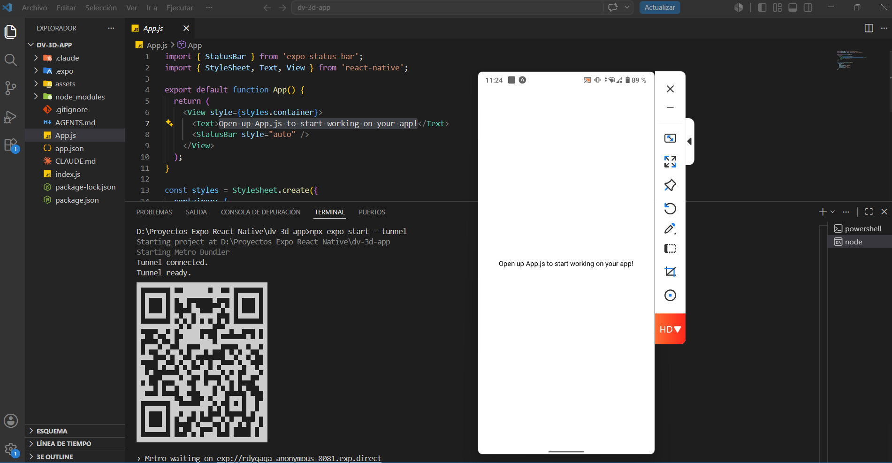

# dv3D

Aplicación móvil para visualización interactiva de objetos 3D, desarrollada con **Expo React Native** y **React Three Fiber**.

> **Estado actual del proyecto:** 🚧 En desarrollo — MVP en construcción. Las funcionalidades descritas en este documento corresponden al alcance planificado para la primera versión (MVP).

---

## Tabla de contenidos

- [Problema que resuelve](#problema-que-resuelve)
- [Objetivo de la aplicación](#objetivo-de-la-aplicación)
- [Historias de usuario del MVP](#historias-de-usuario-del-mvp-producto-mínimo-viable)
- [Tecnología usada](#tecnología-usada)
- [Instrucciones de instalación](#instrucciones-de-instalación)
- [Configuración de Firebase Authentication](#configuración-de-firebase-authentication)
- [Estructura del proyecto](#estructura-del-proyecto)
- [Estado actual del proyecto](#estado-actual-del-proyecto)

---

## Problema que resuelve

La falta de aplicaciones móviles enfocadas en visualización 3D interactiva dificulta que los usuarios experimenten nuevas formas de interacción digital mediante modelos tridimensionales, especialmente en proyectos educativos, demostrativos o de aprendizaje tecnológico.

Ante esta situación, surge la necesidad de desarrollar una aplicación móvil que permita la visualización interactiva de objetos en 3D utilizando **Expo React Native** y **React Three Fiber**, con el propósito de ofrecer una experiencia gráfica moderna y dinámica en dispositivos móviles.

## Objetivo de la aplicación

Desarrollar una aplicación móvil utilizando Expo React Native con React Three Fiber, que permita la visualización interactiva de objetos tridimensionales ofreciendo una experiencia gráfica dinámica y moderna en dispositivos móviles.

## Historias de usuario del MVP (Producto Mínimo Viable)

| ID | Título | Historia |
|----|--------|----------|
| HU-01 | Registro | Como visitante nuevo de la aplicación, quiero registrarme con mi correo electrónico y una contraseña, para crear una cuenta y acceder a las funcionalidades de dv3D. |
| HU-02 | Inicio de sesión | Como usuario registrado, quiero iniciar sesión con mi correo y contraseña, para acceder a mi cuenta y usar la app. |
| HU-03 | Ver catálogo de modelos 3D | Como usuario autenticado, quiero ver una galería con miniaturas y nombres de los modelos 3D disponibles, para explorar visualmente las opciones antes de elegir una. |
| HU-04 | Visualización de un modelo 3D | Como usuario autenticado que seleccionó un modelo, quiero ver el objeto renderizado en pantalla, para apreciar sus detalles visuales antes de interactuar con él. |
| HU-05 | Rotación táctil | Como usuario visualizando un modelo 3D, quiero rotar el objeto arrastrando el dedo sobre la pantalla, para observarlo desde diferentes ángulos. |
| HU-06 | Zoom táctil | Como usuario visualizando un modelo 3D, quiero acercar o alejar el objeto con un gesto de pellizco (pinch), para examinar detalles específicos de cerca. |

## Tecnología usada

- **[Expo](https://expo.dev/)** — Framework para desarrollar aplicaciones multiplataforma con React Native.
- **React Native** — Biblioteca para construir interfaces nativas usando JavaScript/React.
- **React Three Fiber** — Renderer de Three.js para React, utilizado para la visualización e interacción con los modelos 3D.
- **Firebase Authentication** — Servicio de autenticación utilizado para el registro e inicio de sesión de usuarios mediante correo electrónico y contraseña.
- **React Navigation** (`@react-navigation/native-stack`) — Manejo de la navegación entre pantallas, incluyendo la navegación condicional según el estado de sesión del usuario.
- **AsyncStorage** (`@react-native-async-storage/async-storage`) — Persistencia local de la sesión de Firebase Authentication entre reinicios de la app.

## Instrucciones de instalación

### Fase 1. Instalaciones previas requeridas

**1. Instala Node.js**

Node.js es el motor que permite ejecutar JavaScript fuera del navegador. Expo lo necesita para funcionar.

1. Ve a [nodejs.org](https://nodejs.org)
2. Descarga la versión **LTS** (la recomendada, más estable)
3. Instálala con las opciones por defecto
4. Para verificar que se instaló correctamente, abre una terminal y escribe:

```bash
node --version
npm --version
npx --version
```


**2. Instala Visual Studio Code**

Ve a [code.visualstudio.com](https://code.visualstudio.com) y descarga e instala la versión correspondiente a tu sistema operativo.


**3. Instala la app Expo Go en tu dispositivo Android o iOS**

Necesaria para probar la aplicación directamente en tu teléfono.

1. Abre la App Store (iPhone) o Google Play (Android)
2. Busca **"Expo Go"**
3. Instálala y ábrela
   


### Fase 2. Crear el proyecto

**4. Abre la terminal y navega a la carpeta donde quieras crear tu proyecto:**

```bash
cd rutaCarpeta
```

**5. Crea la aplicación React Native con Expo**

Ejecuta este comando para crear una aplicación desde cero (plantilla vacía) que utiliza JavaScript por defecto:

```bash
npx create-expo-app@latest --template blank dv-3d-app
```

`dv-3d-app` es el nombre del proyecto que vas a crear. A continuación, elige la versión del SDK de Expo que sea compatible con Expo Go. Espera a que se descarguen las librerías necesarias para la creación del proyecto; esta tarea se realiza mediante el manejador de paquetes de Node (npm).


**6. Instala las dependencias del proyecto**

Con el proyecto ya creado, instala las librerías necesarias para autenticación y navegación:

```bash
npx expo install firebase @react-native-async-storage/async-storage
npx expo install @react-navigation/native @react-navigation/native-stack
npx expo install react-native-screens react-native-safe-area-context
```

**7. Ejecuta la aplicación**

a) Navega a la carpeta del proyecto:

```bash
cd dv-3d-app
```

b) Abre el proyecto en VS Code:

```bash
code .
```

Con esto verás todos los archivos que forman la estructura del proyecto en el panel izquierdo de VS Code.

c) En la terminal, inicia el servidor de Expo:

```bash
npx expo start
```

Esto hace que la aplicación esté disponible para ser consumida a través del teléfono escaneando el código QR.

d) **Importante:** existe la opción de conexión por **túnel** o **LAN** (por defecto está LAN). Para que LAN funcione, el teléfono y la computadora deben estar en la misma red. Si estuvieran en redes diferentes, utiliza túnel.

> Si no logras consumir la aplicación con Expo Go en el teléfono al iniciar el servidor de desarrollo con `npx expo start`, aun estando en la misma red tanto en tu ordenador como en tu teléfono, puede deberse a la configuración del router. Puedes solucionarlo eligiendo el tipo de conexión **"Túnel"** al iniciar el servidor de desarrollo y volviendo a escanear el código QR, ejecutando:
>
> ```bash
> npx expo start --tunnel
> ```

**8. En tu teléfono Android (o iOS):**

1. Abre la app **Expo Go**
2. Toca **"Scan QR code"**
3. Escanea el código QR que aparece en la terminal

En pocos segundos verás tu app corriendo en tu teléfono. Con la autenticación ya implementada, verás la pantalla de **Login**.


**9. Para detener el servidor de desarrollo**, presiona `Ctrl + C` en la línea de comandos.

**10. Para recargar la app manualmente** después de hacer cambios en el código (si el Fast Refresh automático no se aplica):

- Presiona `r` en la terminal donde corre `npx expo start`.
- O agita el dispositivo físico / presiona `Ctrl+M` (Windows/Linux) o `Cmd+M` (Mac) en el emulador para abrir el menú de desarrollo y seleccionar **"Reload"**.

## Configuración de Firebase Authentication

La app utiliza **Firebase Authentication** con el proveedor de **correo electrónico/contraseña** para el registro e inicio de sesión de usuarios.

### 1. Crear el proyecto en Firebase

1. Ve a [console.firebase.google.com](https://console.firebase.google.com)
2. **Agregar proyecto** → sigue el asistente (Google Analytics es opcional)

### 2. Registrar la app dentro del proyecto

1. En el panel del proyecto, haz clic en el ícono **`</>`** (Web) para agregar una app web — esto es correcto incluso para un proyecto Expo, ya que se utiliza el SDK web de Firebase
2. Ponle un nombre a la app (ej. "dv3D")
3. **No** marques "Firebase Hosting"
4. Copia el objeto `firebaseConfig` que te entrega Firebase

### 3. Configurar `firebaseConfig.js`

Crea el archivo `firebaseConfig.js` en la raíz del proyecto con los datos copiados en el paso anterior:

```javascript
import { initializeApp } from 'firebase/app';
import { initializeAuth, getReactNativePersistence } from 'firebase/auth';
import AsyncStorage from '@react-native-async-storage/async-storage';

const firebaseConfig = {
  apiKey: 'TU_API_KEY',
  authDomain: 'tu-proyecto.firebaseapp.com',
  projectId: 'tu-proyecto',
  storageBucket: 'tu-proyecto.appspot.com',
  messagingSenderId: '123456789',
  appId: 'TU_APP_ID',
};

const app = initializeApp(firebaseConfig);

export const auth = initializeAuth(app, {
  persistence: getReactNativePersistence(AsyncStorage),
});
```

> Se usa `initializeAuth` con `getReactNativePersistence` en lugar de `getAuth()` para que la sesión del usuario persista entre reinicios de la app (de lo contrario, Firebase solo guarda la sesión en memoria).

### 4. Habilitar el método de autenticación

En la consola de Firebase: **Authentication → Sign-in method → Add new provider → Correo electrónico/contraseña → Habilitar**.

Sin este paso, las funciones de registro e inicio de sesión fallarán con el error `auth/operation-not-allowed`.

### 5. Revisar usuarios registrados (para pruebas)

En **Authentication → Users** puedes ver, inspeccionar o eliminar manualmente las cuentas creadas durante las pruebas de la app.

## Estructura del proyecto

```
dv-3d-app/
├── App.js                       # Punto de entrada: envuelve la app con AuthProvider y RootNavigator
├── firebaseConfig.js            # Configuración e inicialización de Firebase Authentication
├── theme.js                     # Paleta de colores y estilos compartidos
├── validation.js                # Funciones de validación de formularios (correo, contraseña, nombre)
├── context/
│   └── AuthContext.js           # Contexto global de sesión (onAuthStateChanged)
├── navigation/
│   ├── AuthStack.js             # Stack de pantallas sin sesión: Login, Register
│   ├── AppStack.js              # Stack de pantallas con sesión: ModelSelection, ModelViewer
│   └── RootNavigator.js         # Decide qué stack mostrar según el estado de sesión
└── screens/
    ├── LoginScreen.js           # Formulario de inicio de sesión
    ├── RegisterScreen.js        # Formulario de registro
    ├── ModelSelectionScreen.js  # Pantalla principal (placeholder, pendiente HU-03)
    └── ModelViewerScreen.js     # Visualizador de modelos 3D (placeholder, pendiente HU-04, HU-05, HU-06)
```

### Flujo de autenticación

1. Al iniciar la app, `AuthProvider` escucha los cambios de sesión con `onAuthStateChanged` de Firebase.
2. Mientras se resuelve el estado de sesión, se muestra un indicador de carga.
3. **Sin sesión activa** → se muestra `AuthStack` (Login / Register).
4. **Con sesión activa** → se muestra `AppStack` (pantalla principal).
5. El registro de un nuevo usuario cierra la sesión automáticamente después de crear la cuenta (`signOut`), para que el usuario inicie sesión manualmente en vez de quedar autenticado sin confirmarlo.
6. La navegación entre `AuthStack` y `AppStack` es automática: no se hace con `navigation.navigate`, sino que reacciona al cambio de estado de sesión detectado por `onAuthStateChanged`.

## Estado actual del proyecto

- [x] Definición del problema, objetivo y alcance del MVP
- [x] Definición de historias de usuario del MVP
- [x] Configuración inicial del proyecto con Expo
- [x] Implementación de registro de usuarios (HU-01)
- [x] Implementación de inicio de sesión (HU-02)
- [ ] Implementación del catálogo de modelos 3D (HU-03)
- [ ] Implementación de la visualización de modelos 3D con React Three Fiber (HU-04)
- [ ] Implementación de rotación táctil (HU-05)
- [ ] Implementación de zoom táctil (HU-06)

---

*Este README se actualizará conforme avance el desarrollo del proyecto.*