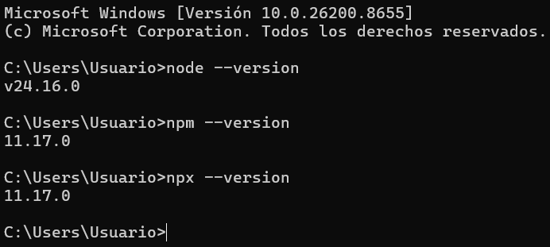
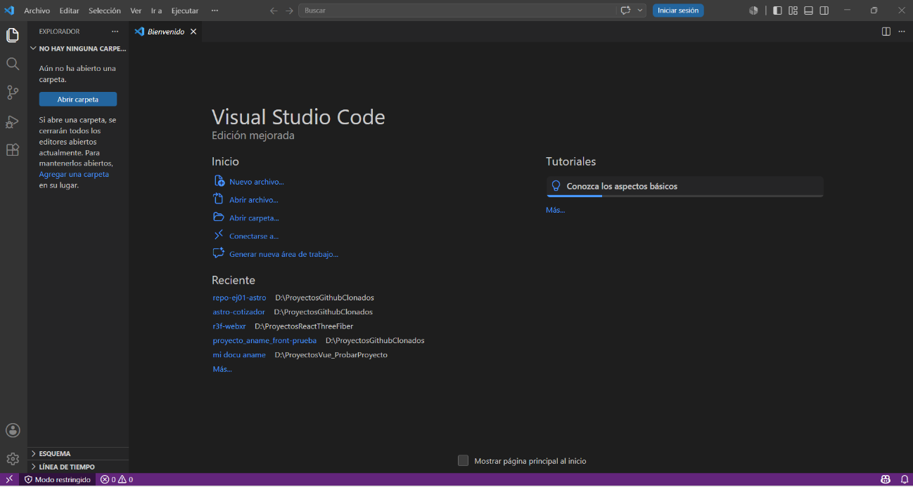
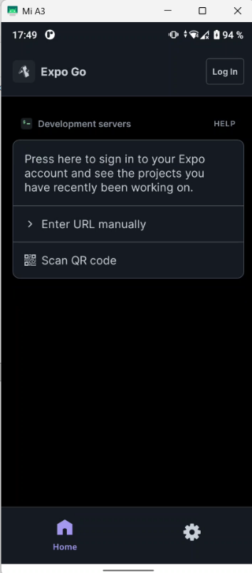
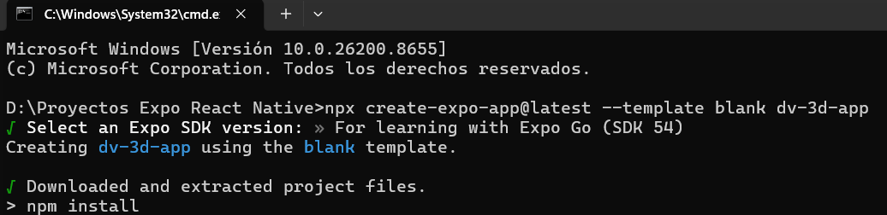
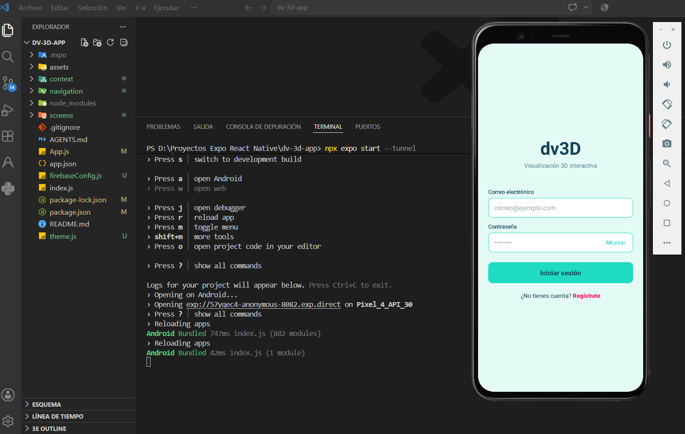

# dv3D

Aplicación móvil para visualización interactiva de objetos 3D, desarrollada con **Expo React Native** y **React Three Fiber**.

> **Estado actual del proyecto:** 🚧 En desarrollo — MVP en construcción. Las funcionalidades descritas en este documento corresponden al alcance planificado para la primera versión (MVP).

---

## Tabla de contenidos

- [Problema que resuelve](#problema-que-resuelve)
- [Objetivo de la aplicación](#objetivo-de-la-aplicación)
- [Historias de usuario del MVP](#historias-de-usuario-del-mvp-producto-mínimo-viable)
- [Tecnología usada](#tecnología-usada)
- [Instrucciones de instalación](#instrucciones-de-instalación)
- [Configuración de Firebase Authentication](#configuración-de-firebase-authentication)
- [Configuración de Firestore](#configuración-de-firestore)
- [Estructura del proyecto](#estructura-del-proyecto)
- [Estado actual del proyecto](#estado-actual-del-proyecto)

---

## Problema que resuelve

La falta de aplicaciones móviles enfocadas en visualización 3D interactiva dificulta que los usuarios experimenten nuevas formas de interacción digital mediante modelos tridimensionales, especialmente en proyectos educativos, demostrativos o de aprendizaje tecnológico.

Ante esta situación, surge la necesidad de desarrollar una aplicación móvil que permita la visualización interactiva de objetos en 3D utilizando **Expo React Native** y **React Three Fiber**, con el propósito de ofrecer una experiencia gráfica moderna y dinámica en dispositivos móviles.

## Objetivo de la aplicación

Desarrollar una aplicación móvil utilizando Expo React Native con React Three Fiber, que permita la visualización interactiva de objetos tridimensionales ofreciendo una experiencia gráfica dinámica y moderna en dispositivos móviles.

## Historias de usuario del MVP (Producto Mínimo Viable)

| ID | Título | Historia |
|----|--------|----------|
| HU-01 | Registro | Como visitante nuevo de la aplicación, quiero registrarme con mi correo electrónico y una contraseña, para crear una cuenta y acceder a las funcionalidades de dv3D. |
| HU-02 | Inicio de sesión | Como usuario registrado, quiero iniciar sesión con mi correo y contraseña, para acceder a mi cuenta y usar la app. |
| HU-03 | Ver catálogo de modelos 3D | Como usuario autenticado, quiero ver una galería con miniaturas y nombres de los modelos 3D disponibles, para explorar visualmente las opciones antes de elegir una. |
| HU-04 | Visualización de un modelo 3D | Como usuario autenticado que seleccionó un modelo, quiero ver el objeto renderizado en pantalla, para apreciar sus detalles visuales antes de interactuar con él. |
| HU-05 | Rotación táctil | Como usuario visualizando un modelo 3D, quiero rotar el objeto arrastrando el dedo sobre la pantalla, para observarlo desde diferentes ángulos. |
| HU-06 | Zoom táctil | Como usuario visualizando un modelo 3D, quiero acercar o alejar el objeto con un gesto de pellizco (pinch), para examinar detalles específicos de cerca. |

## Tecnología usada

- **[Expo](https://expo.dev/)** — Framework para desarrollar aplicaciones multiplataforma con React Native.
- **React Native** — Biblioteca para construir interfaces nativas usando JavaScript/React.
- **React Three Fiber** (`@react-three/fiber`) — Renderer declarativo de Three.js para React, utilizado para la visualización e interacción con los modelos 3D.
- **Three.js** (`three`) — Motor 3D base sobre el que funciona React Three Fiber.
- **expo-gl** — Contexto WebGL nativo requerido por React Three Fiber para renderizar en un `<Canvas>` dentro de Expo.
- **expo-asset** — Carga de archivos locales empaquetados con la app (modelos `.glb`, texturas) como assets accesibles por URI.
- **react-native-gesture-handler** — Detección de gestos táctiles (arrastrar para rotar, pellizco para zoom) sobre el visor 3D.
- **react-native-reanimated** + **react-native-worklets** — Ejecutan la lógica de los gestos en el hilo de UI, evitando lag al actualizar la rotación/escala del modelo en cada frame.
- **Firebase Authentication** — Servicio de autenticación utilizado para el registro e inicio de sesión de usuarios mediante correo electrónico y contraseña.
- **Firebase Firestore** — Base de datos donde se almacenan los metadatos de los modelos 3D del catálogo (nombre, descripción, URLs, propietario, etc.).
- **Cloudinary** — Almacenamiento de archivos (modelos `.glb` y miniaturas). Se usa en vez de Firebase Storage porque este último requiere el plan de pago "Blaze" (exige tarjeta de crédito registrada); Cloudinary ofrece una capa gratuita generosa sin necesidad de tarjeta.
- **expo-document-picker** — Selector nativo de archivos del sistema, usado para elegir modelos `.glb`/`.gltf` propios desde el teléfono.
- **react-native-view-shot** — Captura una imagen (miniatura) de lo que se ve en el visor 3D al momento de guardar un modelo en el catálogo.
- **React Navigation** (`@react-navigation/native-stack`) — Manejo de la navegación entre pantallas, incluyendo la navegación condicional según el estado de sesión del usuario.
- **AsyncStorage** (`@react-native-async-storage/async-storage`) — Persistencia local de la sesión de Firebase Authentication entre reinicios de la app.

## Instrucciones de instalación

### Fase 1. Instalaciones previas requeridas

**1. Instala Node.js**

Node.js es el motor que permite ejecutar JavaScript fuera del navegador. Expo lo necesita para funcionar.

1. Ve a [nodejs.org](https://nodejs.org)
2. Descarga la versión **LTS** (la recomendada, más estable)
3. Instálala con las opciones por defecto
4. Para verificar que se instaló correctamente, abre una terminal y escribe:

```bash
node --version
npm --version
npx --version
```


**2. Instala Visual Studio Code**

Ve a [code.visualstudio.com](https://code.visualstudio.com) y descarga e instala la versión correspondiente a tu sistema operativo.


**3. Instala la app Expo Go en tu dispositivo Android o iOS**

Necesaria para probar la aplicación directamente en tu teléfono.

1. Abre la App Store (iPhone) o Google Play (Android)
2. Busca **"Expo Go"**
3. Instálala y ábrela
   


### Fase 2. Crear el proyecto

**4. Abre la terminal y navega a la carpeta donde quieras crear tu proyecto:**

```bash
cd rutaCarpeta
```

**5. Crea la aplicación React Native con Expo**

Ejecuta este comando para crear una aplicación desde cero (plantilla vacía) que utiliza JavaScript por defecto:

```bash
npx create-expo-app@latest --template blank dv-3d-app
```

`dv-3d-app` es el nombre del proyecto que vas a crear. A continuación, elige la versión del SDK de Expo que sea compatible con Expo Go. Espera a que se descarguen las librerías necesarias para la creación del proyecto; esta tarea se realiza mediante el manejador de paquetes de Node (npm).


**6. Instala las dependencias del proyecto**

Con el proyecto ya creado, instala las librerías necesarias para autenticación y navegación:

```bash
npx expo install firebase @react-native-async-storage/async-storage
npx expo install @react-navigation/native @react-navigation/native-stack
npx expo install react-native-screens react-native-safe-area-context
npx expo install three @react-three/fiber @react-three/drei
npx expo install expo-gl expo-asset expo-file-system
npx expo install react-native-gesture-handler react-native-reanimated react-native-worklets
npx expo install expo-document-picker react-native-view-shot
```

**7. Ejecuta la aplicación**

a) Navega a la carpeta del proyecto:

```bash
cd dv-3d-app
```

b) Abre el proyecto en VS Code:

```bash
code .
```

Con esto verás todos los archivos que forman la estructura del proyecto en el panel izquierdo de VS Code.

c) En la terminal, inicia el servidor de Expo:

```bash
npx expo start
```

Esto hace que la aplicación esté disponible para ser consumida a través del teléfono escaneando el código QR.

d) **Importante:** existe la opción de conexión por **túnel** o **LAN** (por defecto está LAN). Para que LAN funcione, el teléfono y la computadora deben estar en la misma red. Si estuvieran en redes diferentes, utiliza túnel.

> Si no logras consumir la aplicación con Expo Go en el teléfono al iniciar el servidor de desarrollo con `npx expo start`, aun estando en la misma red tanto en tu ordenador como en tu teléfono, puede deberse a la configuración del router. Puedes solucionarlo eligiendo el tipo de conexión **"Túnel"** al iniciar el servidor de desarrollo y volviendo a escanear el código QR, ejecutando:
>
> ```bash
> npx expo start --tunnel
> ```

**8. En tu teléfono Android (o iOS):**

1. Abre la app **Expo Go**
2. Toca **"Scan QR code"**
3. Escanea el código QR que aparece en la terminal

En pocos segundos verás tu app corriendo en tu teléfono. Con la autenticación ya implementada, verás la pantalla de **Login** como parte de las nuevas funcionalidades implementadas.


**9. Para detener el servidor de desarrollo**, presiona `Ctrl + C` en la línea de comandos.

**10. Para recargar la app manualmente** después de hacer cambios en el código (si el Fast Refresh automático no se aplica):

- Presiona `r` en la terminal donde corre `npx expo start`.
- O agita el dispositivo físico / presiona `Ctrl+M` (Windows/Linux) o `Cmd+M` (Mac) en el emulador para abrir el menú de desarrollo y seleccionar **"Reload"**.

## Configuración de Firebase Authentication

La app utiliza **Firebase Authentication** con el proveedor de **correo electrónico/contraseña** para el registro e inicio de sesión de usuarios.

### 1. Crear el proyecto en Firebase

1. Ve a [console.firebase.google.com](https://console.firebase.google.com)
2. **Agregar proyecto** → sigue el asistente (Google Analytics es opcional)

### 2. Registrar la app dentro del proyecto

1. En el panel del proyecto, haz clic en el ícono **`</>`** (Web) para agregar una app web — esto es correcto incluso para un proyecto Expo, ya que se utiliza el SDK web de Firebase
2. Ponle un nombre a la app (ej. "dv3D")
3. **No** marques "Firebase Hosting"
4. Copia el objeto `firebaseConfig` que te entrega Firebase

### 3. Configurar `firebaseConfig.js`

Crea el archivo `firebaseConfig.js` en la raíz del proyecto con los datos copiados en el paso anterior:

```javascript
import { initializeApp } from 'firebase/app';
import { initializeAuth, getReactNativePersistence } from 'firebase/auth';
import AsyncStorage from '@react-native-async-storage/async-storage';

const firebaseConfig = {
  apiKey: 'TU_API_KEY',
  authDomain: 'tu-proyecto.firebaseapp.com',
  projectId: 'tu-proyecto',
  storageBucket: 'tu-proyecto.appspot.com',
  messagingSenderId: '123456789',
  appId: 'TU_APP_ID',
};

const app = initializeApp(firebaseConfig);

export const auth = initializeAuth(app, {
  persistence: getReactNativePersistence(AsyncStorage),
});
```

> Se usa `initializeAuth` con `getReactNativePersistence` en lugar de `getAuth()` para que la sesión del usuario persista entre reinicios de la app (de lo contrario, Firebase solo guarda la sesión en memoria).

### 4. Habilitar el método de autenticación

En la consola de Firebase: **Authentication → Sign-in method → Add new provider → Correo electrónico/contraseña → Habilitar**.

Sin este paso, las funciones de registro e inicio de sesión fallarán con el error `auth/operation-not-allowed`.

### 5. Revisar usuarios registrados (para pruebas)

En **Authentication → Users** puedes ver, inspeccionar o eliminar manualmente las cuentas creadas durante las pruebas de la app.

## Configuración de Firestore

La app usa **Firestore** para almacenar los metadatos del catálogo de modelos 3D (nombre, descripción, URLs del modelo/miniatura, propietario, etc.) — el archivo `.glb` en sí y su imagen de miniatura se alojarán en Firebase Storage (pendiente de implementar).

### 1. Crear la base de datos

1. En la consola de Firebase: **Firestore Database → Crear base de datos**.
2. Selecciona **Modo de producción** (no "modo de prueba" — se configuran reglas específicas en el siguiente paso).
3. Elige la ubicación del servidor más cercana a tus usuarios (no se puede cambiar después de creada).

### 2. Configurar Security Rules

En **Firestore Database → Rules**:

```javascript
rules_version = '2';
service cloud.firestore {
  match /databases/{database}/documents {
    match /models/{modelId} {
      // Cualquier usuario autenticado puede leer el catálogo
      allow read: if request.auth != null;

      // Solo el dueño puede crear/editar/eliminar sus propios modelos
      allow create: if request.auth != null
                    && request.resource.data.ownerId == request.auth.uid;
      allow update, delete: if request.auth != null
                    && resource.data.ownerId == request.auth.uid;
    }
  }
}
```

### 3. Esquema de la colección `models`

```javascript
{
  id: "auto-generado por Firestore",
  name: "Aldeana",
  description: "Personaje de aldea, estilo low-poly",
  category: "personajes",

  modelUrl: "https://firebasestorage.../aldeana_appExpo.glb",
  modelType: "glb",                     // "glb" | "gltf" | "stl" (para Thingiverse a futuro)
  thumbnailUrl: "https://firebasestorage.../aldeana_thumb.png",

  initialScale: 1,
  initialPosition: { x: 0, y: 0, z: 0 },

  source: "local",                      // "local" | "polypizza" | "thingiverse"
  externalId: null,
  attribution: null,

  ownerId: "uid-del-usuario-de-firebase-auth",
  createdAt: "<Firestore Timestamp>",
  updatedAt: "<Firestore Timestamp>",
}
```

`modelType` y `source` dejan la estructura lista para integrar más adelante modelos de Poly Pizza y archivos `.stl` de Thingiverse sin tener que rediseñar la colección.

## Configuración de Cloudinary (almacenamiento de archivos)

Los archivos `.glb` y las miniaturas de los modelos se alojan en **Cloudinary** en vez de Firebase Storage, porque Firebase Storage requiere el plan de pago "Blaze" (pide una tarjeta de crédito registrada, aunque no cobre dentro de la capa gratuita). Cloudinary ofrece 25GB de almacenamiento y transferencia mensual gratis, sin tarjeta.

### 1. Crear cuenta gratuita

Regístrate en [cloudinary.com](https://cloudinary.com) con tu correo. En el **Dashboard**, copia tu **Cloud name**.

### 2. Crear un upload preset sin firma

En **Settings → Upload → Upload presets → Add upload preset**, cambia **Signing Mode** a **Unsigned** y guarda. Esto permite subir archivos desde la app sin exponer credenciales secretas.

### 3. Configurar `services/storage.js`

Reemplaza los valores de ejemplo con los tuyos:

```javascript
const CLOUD_NAME = 'TU_CLOUD_NAME';
const UPLOAD_PRESET = 'TU_UPLOAD_PRESET';
```

## Estructura del proyecto

```
dv-3d-app/
├── App.js                       # Punto de entrada: polyfills, GestureHandlerRootView, AuthProvider, RootNavigator
├── polyfills.js                 # Shims (atob/btoa/TextEncoder) requeridos por Hermes para decodificar datos binarios
├── firebaseConfig.js            # Configuración e inicialización de Firebase (Auth + Firestore)
├── metro.config.js              # Config de Metro: reconoce .glb/.gltf como assets
├── babel.config.js              # Preset de Expo + plugin de react-native-reanimated
├── theme.js                     # Paleta de colores y estilos compartidos
├── validation.js                # Funciones de validación de formularios (correo, contraseña, nombre)
├── context/
│   └── AuthContext.js           # Contexto global de sesión (onAuthStateChanged)
├── services/
│   ├── models.js                # CRUD de la colección "models" en Firestore
│   └── storage.js               # Subida de archivos (.glb + miniatura) a Cloudinary
├── navigation/
│   ├── AuthStack.js             # Stack de pantallas sin sesión: Login, Register
│   ├── AppStack.js              # Stack de pantallas con sesión: ModelSelection, ModelViewer
│   └── RootNavigator.js         # Decide qué stack mostrar según el estado de sesión
├── screens/
│   ├── LoginScreen.js           # Formulario de inicio de sesión
│   ├── RegisterScreen.js        # Formulario de registro
│   ├── ModelSelectionScreen.js  # Pantalla principal (placeholder, pendiente catálogo HU-03)
│   └── ModelViewerScreen.js     # Visor 3D: carga .glb, textura, rotación y zoom táctil
└── assets/
    └── models/
        ├── aldeana_appExpo.glb  # Modelo de prueba
        └── aldeana_textura.png  # Textura del modelo de prueba
```

### Flujo de autenticación

1. Al iniciar la app, `AuthProvider` escucha los cambios de sesión con `onAuthStateChanged` de Firebase.
2. Mientras se resuelve el estado de sesión, se muestra un indicador de carga.
3. **Sin sesión activa** → se muestra `AuthStack` (Login / Register).
4. **Con sesión activa** → se muestra `AppStack` (pantalla principal).
5. El registro de un nuevo usuario cierra la sesión automáticamente después de crear la cuenta (`signOut`), para que el usuario inicie sesión manualmente en vez de quedar autenticado sin confirmarlo.
6. La navegación entre `AuthStack` y `AppStack` es automática: no se hace con `navigation.navigate`, sino que reacciona al cambio de estado de sesión detectado por `onAuthStateChanged`.

### Visor 3D

`ModelViewerScreen` carga y muestra un modelo `.glb` con textura e interacción táctil completa:

- **Carga del modelo**: se descarga el `.glb` con `expo-asset`, se leen sus bytes y se eliminan las referencias a texturas embebidas antes de parsearlo con `GLTFLoader` — esto evita que la librería intente decodificar imágenes en base64 (algo que no funciona en React Native) y acelera la carga considerablemente.
- **Textura**: se aplica manualmente creando una `THREE.Texture` a partir del asset de la imagen, ajustando `flipY` y `colorSpace` según la convención de UV de glTF.
- **Rotación táctil**: horizontal libre (eje Y) y vertical limitada a ±45° (eje X), mediante `Gesture.Pan` de `react-native-gesture-handler`.
- **Zoom táctil**: `Gesture.Pinch`, escala el modelo entre 0.5x y 3x.
- Ambos gestos usan `react-native-reanimated` (`useSharedValue` + `useFrame`) para actualizar la rotación/escala directamente en el hilo de UI en cada frame, evitando el lag de cruzar el puente JS en cada movimiento del dedo.
- El detector de gestos se coloca en una capa transparente **superpuesta** al `Canvas` (no como su contenedor) para evitar conflictos de captura de toque con la vista nativa del renderer.

> El visor recibe el modelo por parámetro de navegación (`route.params.modelUri`). Sin parámetros, muestra el modelo de prueba empaquetado (`aldeana_appExpo.glb`). Con un modelo elegido por el usuario, se muestra sin textura (limitación conocida — no hay un archivo de textura separado para modelos arbitrarios).

### Catálogo de modelos (HU-03)

`ModelSelectionScreen` ahora es un catálogo real en vez de un placeholder:

- Consulta `getAllModels()` de Firestore y muestra una cuadrícula (`FlatList`, 2 columnas) con la miniatura y el nombre de cada modelo guardado.
- `useFocusEffect` recarga la lista automáticamente cada vez que la pantalla vuelve a tener foco — por ejemplo, al regresar del visor después de guardar un modelo nuevo.
- Tocar una tarjeta abre el visor con `fromCatalog: true`, lo que oculta el botón "Guardar en mi catálogo" (el modelo ya está guardado).
- Se mantienen los accesos a "Seleccionar modelo desde mi teléfono" y "Ver modelo de prueba" como pie de página.

### Selección de modelo local y guardado en el catálogo

- **`expo-document-picker`** permite elegir un archivo `.glb`/`.gltf` desde el almacenamiento del teléfono (la app no tiene acceso directo al sistema de archivos por seguridad; el picker devuelve una URI temporal accesible solo por la app).
- Desde el visor, con un modelo elegido por el usuario, aparece el botón **"Guardar en mi catálogo"**:
  1. `react-native-view-shot` captura una miniatura de lo que se ve en el `Canvas` en ese momento.
  2. `services/storage.js` sube el `.glb` original y esa miniatura a Cloudinary.
  3. `services/models.js` crea el documento correspondiente en Firestore con las URLs resultantes.

### Editar y eliminar modelos (CRUD completo)

Al abrir un modelo desde el catálogo, si el usuario autenticado es el dueño (`ownerId` coincide con su UID), aparecen los botones **Editar** y **Eliminar**:

- **Editar**: despliega un formulario inline (nombre, categoría, descripción) y guarda los cambios con `updateModel()`.
- **Eliminar**: pide confirmación y elimina el documento con `deleteModel()`, regresando al catálogo.

La comprobación de `ownerId` en la app es solo para la experiencia de usuario (ocultar botones que no aplican); la seguridad real la garantizan las Security Rules de Firestore, que rechazan cualquier intento de editar/eliminar un documento que no pertenezca al usuario autenticado, sin importar lo que haga la interfaz.

## Estado actual del proyecto

- [x] Definición del problema, objetivo y alcance del MVP
- [x] Definición de historias de usuario del MVP
- [x] Configuración inicial del proyecto con Expo
- [x] Implementación de registro de usuarios (HU-01)
- [x] Implementación de inicio de sesión (HU-02)
- [ ] Implementación del catálogo de modelos 3D (HU-03)
- [x] Implementación de la visualización de modelos 3D con React Three Fiber (HU-04)
- [x] Implementación de rotación táctil (HU-05)
- [x] Implementación de zoom táctil (HU-06)
- [x] Definición del esquema de Firestore para el catálogo de modelos
- [x] Selección de modelo `.glb` propio desde el teléfono (`expo-document-picker`)
- [x] Guardado de modelos en Firestore + Cloudinary (crear: modelo + miniatura + metadatos)
- [x] Catálogo de modelos 3D — listado con miniaturas (HU-03)
- [x] Actualizar/eliminar modelos guardados (UPDATE/DELETE del CRUD)
- [ ] Integración con Poly Pizza API
- [ ] Estructura preparada para integración futura con Thingiverse (`.stl`)

---

*Este README se actualizará conforme avance el desarrollo del proyecto.*