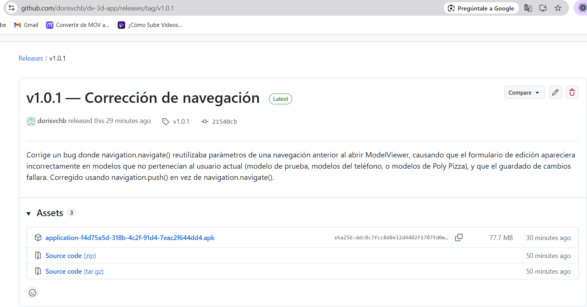
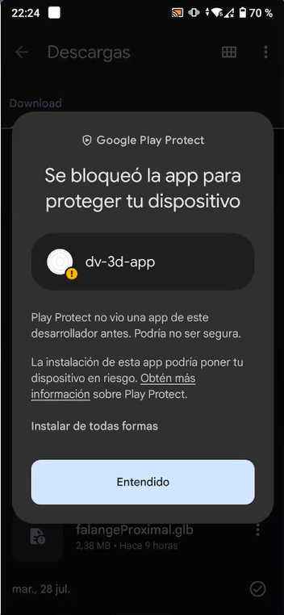
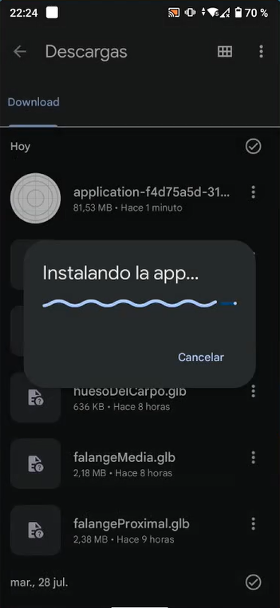
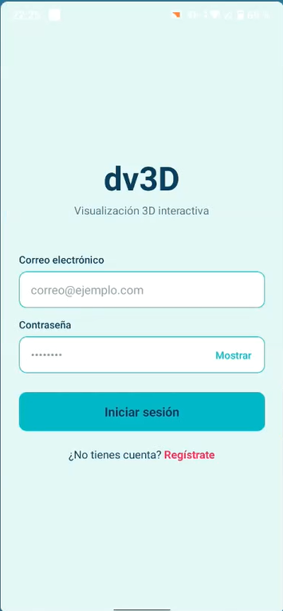
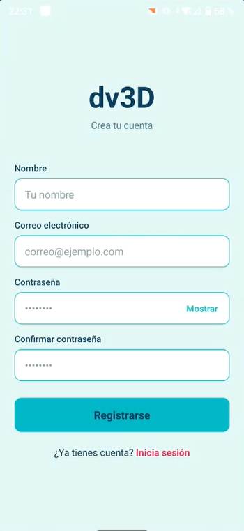
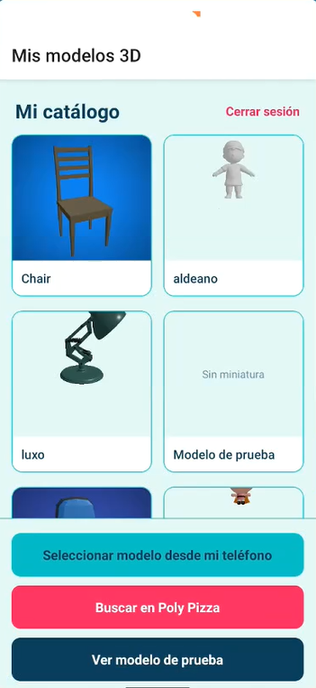
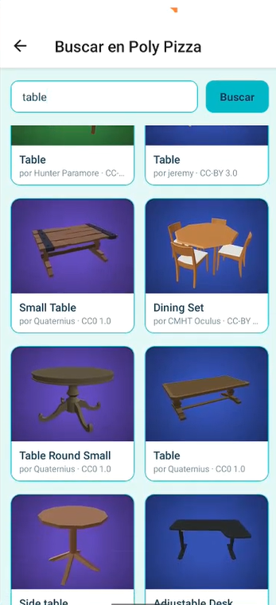
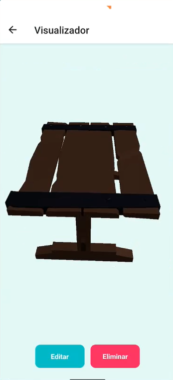
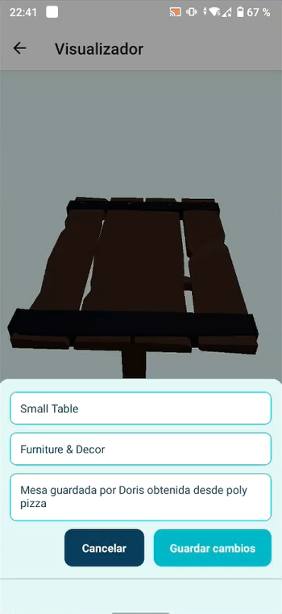

# Manual de Usuario — dv3D

## ¿Qué hace esta app?

dv3D es una aplicación móvil para explorar y coleccionar objetos en 3D directamente desde tu teléfono. Puedes ver modelos girándolos con el dedo, acercarlos con un pellizco, subir tus propios archivos 3D, o buscar modelos gratuitos ya listos para usar — todo se guarda en tu catálogo personal para que puedas volver a verlos cuando quieras.

---

## Instalación

### Requisitos

- Teléfono Android 8.0 o superior (recomendado).
- Conexión a internet para crear tu cuenta y sincronizar tus modelos.
- Espacio de almacenamiento libre (aprox. 100–150 MB).

### Pasos para instalar

1. Desde tu teléfono, abre el navegador y entra a la página de **Releases** del proyecto en GitHub.
2. Busca la versión más reciente (por ejemplo, `v1.0.1`) y toca el archivo `.apk` para descargarlo.

   

3. Cuando termine la descarga, tócala para abrirla. Es posible que tu teléfono te muestre una advertencia porque la app no viene de la Play Store — esto es normal para apps instaladas manualmente.
4. Si aparece un mensaje como **"Instalar apps desconocidas"**, activa el permiso para el navegador o la app que estés usando para instalar.

   

5. Toca **Instalar** y espera a que el proceso termine.

   

6. Toca **Abrir** para iniciar la app por primera vez.

---

## Guía de pantallas

### 1. Pantalla de inicio de sesión

Es la primera pantalla que ves al abrir la app. Aquí ingresas tu correo y contraseña para entrar a tu cuenta.

- **Campo de correo electrónico**: escribe el correo con el que te registraste.
- **Campo de contraseña**: tiene un botón de **"Mostrar/Ocultar"** para revisar que la escribiste bien antes de continuar.
- **Botón "Iniciar sesión"**: te lleva directo a tu catálogo si los datos son correctos.
- **Enlace "¿No tienes cuenta? Regístrate"**: te lleva a la pantalla de registro si es tu primera vez usando la app.

### 2. Pantalla de registro

Aquí creas una cuenta nueva si aún no tienes una.

- **Nombre**: cómo quieres que te identifique la app.
- **Correo electrónico**: se usará para iniciar sesión más adelante.
- **Contraseña** y **Confirmar contraseña**: debes escribir la misma contraseña dos veces para evitar errores de tipeo. Ambos campos comparten el mismo botón de **"Mostrar/Ocultar"**.
- **Botón "Registrarse"**: crea tu cuenta. Al terminar, te devuelve a la pantalla de inicio de sesión para que ingreses con tus nuevos datos.

### 3. Pantalla principal — Mi catálogo

Es el corazón de la app: aquí ves todos los modelos 3D disponibles, organizados en una cuadrícula con una imagen de vista previa (miniatura) y el nombre de cada uno.

- **Tarjetas de modelos**: toca cualquiera para abrirlo en el visor 3D y explorarlo.
- **Botón "Seleccionar modelo desde mi teléfono"**: abre el explorador de archivos de tu dispositivo para elegir un modelo 3D que ya tengas descargado.
- **Botón "Buscar en Poly Pizza"**: te lleva a un buscador de modelos 3D gratuitos que puedes agregar a tu catálogo.
- **Botón "Ver modelo de prueba"**: abre un modelo de muestra incluido en la app, útil para explorar los controles sin necesidad de buscar ni subir nada.
- **"Cerrar sesión"** (arriba a la derecha): sale de tu cuenta y regresa a la pantalla de inicio de sesión.

### 4. Buscador de Poly Pizza

Permite encontrar modelos 3D gratuitos hechos por otras personas, listos para agregar a tu colección.

- **Barra de búsqueda**: escribe una palabra clave (por ejemplo, "silla", "árbol", "auto") y toca **Buscar**.
- **Resultados en cuadrícula**: cada tarjeta muestra una vista previa, el nombre del modelo, su autor y el tipo de licencia.
- Toca cualquier resultado para abrirlo en el visor y decidir si quieres agregarlo a tu catálogo.

### 5. Visor 3D

Aquí es donde interactúas con los modelos en tres dimensiones.

- **Girar el modelo**: desliza un dedo horizontalmente sobre la pantalla para rotarlo de izquierda a derecha. Desliza verticalmente para inclinarlo levemente hacia arriba o abajo.
- **Acercar o alejar (zoom)**: pellizca la pantalla con dos dedos, como cuando amplías una foto.
- **Botón "Guardar en mi catálogo"**: aparece cuando estás viendo un modelo nuevo (elegido desde tu teléfono o encontrado en Poly Pizza) que todavía no forma parte de tu colección. Al tocarlo, el modelo queda guardado permanentemente.
- **Botones "Editar" y "Eliminar"**: solo aparecen en los modelos que tú mismo agregaste a tu catálogo.
  - **Editar** abre un formulario donde puedes cambiar el nombre, la categoría y la descripción del modelo.
  - **Eliminar** lo quita de tu catálogo de forma permanente (te pedirá confirmación antes de borrarlo).

### 6. Formulario de edición

Se abre como una ventana sobre el visor al tocar "Editar".

- **Nombre**: el título con el que se muestra el modelo en tu catálogo.
- **Categoría**: una palabra para organizar tus modelos (por ejemplo, "personajes", "muebles").
- **Descripción**: un texto libre para anotar detalles sobre el modelo.
- **Botón "Cancelar"**: cierra el formulario sin guardar cambios.
- **Botón "Guardar cambios"**: actualiza la información del modelo en tu catálogo.

---

## Cómo realizar la tarea principal

Estos son los pasos para ir de "recién instalada la app" a "tener tu propio modelo 3D en tu catálogo":

1. Abre la app e ingresa a **Registrarse**. Completa tu nombre, correo y contraseña, y toca **Registrarse**.
2. Vuelve a la pantalla de inicio de sesión e ingresa con el correo y la contraseña que acabas de crear.
3. En la pantalla principal, elige cómo quieres agregar tu primer modelo:
   - Toca **"Seleccionar modelo desde mi teléfono"** si ya tienes un archivo `.glb` o `.gltf` descargado, o
   - Toca **"Buscar en Poly Pizza"** para encontrar uno gratuito.
4. Explora el modelo: rótalo deslizando el dedo, y acércalo o aléjalo con dos dedos.
5. Cuando estés conforme, toca **"Guardar en mi catálogo"**. Espera a que aparezca el mensaje de confirmación.
6. Regresarás automáticamente a la pantalla principal, donde ahora verás tu modelo con su miniatura en la cuadrícula.
7. Si quieres ajustar el nombre o agregar una descripción, abre el modelo de nuevo y toca **"Editar"**.

---

## Solución de problemas comunes

**"La app no inicia o se cierra sola al abrirla"**
Verifica que tu teléfono cumpla con el requisito mínimo de Android (8.0 o superior). Si el problema continúa, desinstala y vuelve a instalar el APK más reciente desde la página de Releases.

**"Olvidé mi contraseña"**
Por el momento, la app no cuenta con una opción de recuperación de contraseña automática. Si olvidaste tus datos, deberás registrar una cuenta nueva con un correo distinto.

**"Inicié sesión pero no veo mis modelos guardados"**
Confirma que iniciaste sesión con el mismo correo que usaste al guardar esos modelos — cada cuenta tiene su propia sesión, aunque el catálogo general es visible para todos los usuarios.

**"Los cambios que hice al editar un modelo no se guardaron"**
Revisa tu conexión a internet: guardar cambios requiere estar conectado. Si el problema persiste, cierra la app por completo y vuelve a intentarlo.

**"No puedo ver la textura/color de un modelo que agregué"**
Algunos modelos, especialmente los elegidos desde tu teléfono o encontrados en Poly Pizza, pueden mostrarse solo con su forma (sin color ni textura) dependiendo de cómo fueron creados. Esto no afecta la rotación ni el zoom, solo la apariencia visual.

**"La app funciona lenta al rotar o hacer zoom en un modelo"**
Los modelos con mucho detalle (alta cantidad de polígonos) pueden tardar más en responder en teléfonos de gama baja o media. Cierra otras apps abiertas en segundo plano para liberar memoria y vuelve a intentarlo.

**"No puedo instalar el APK"**
Asegúrate de haber activado el permiso de "Instalar apps desconocidas" para la app que usaste para descargarlo (navegador, Archivos, etc.), y de tener espacio suficiente de almacenamiento libre.

---

*Este manual corresponde a la versión v1.0.1 de dv3D.*
